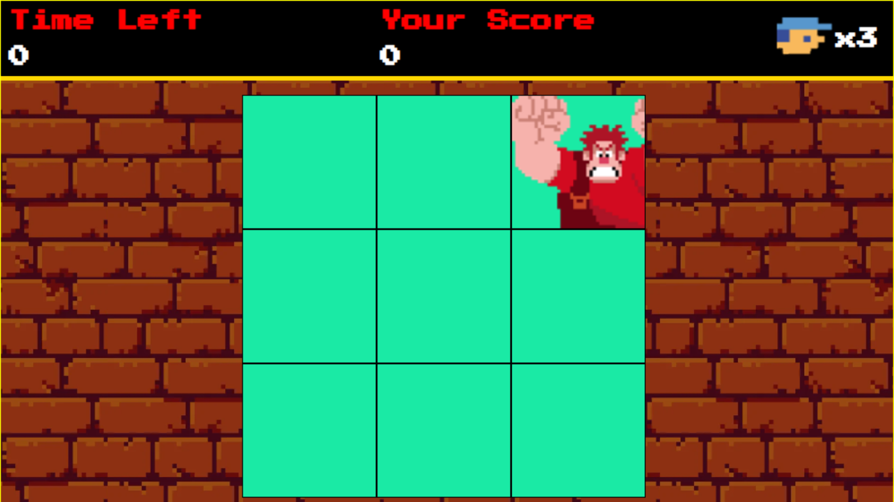
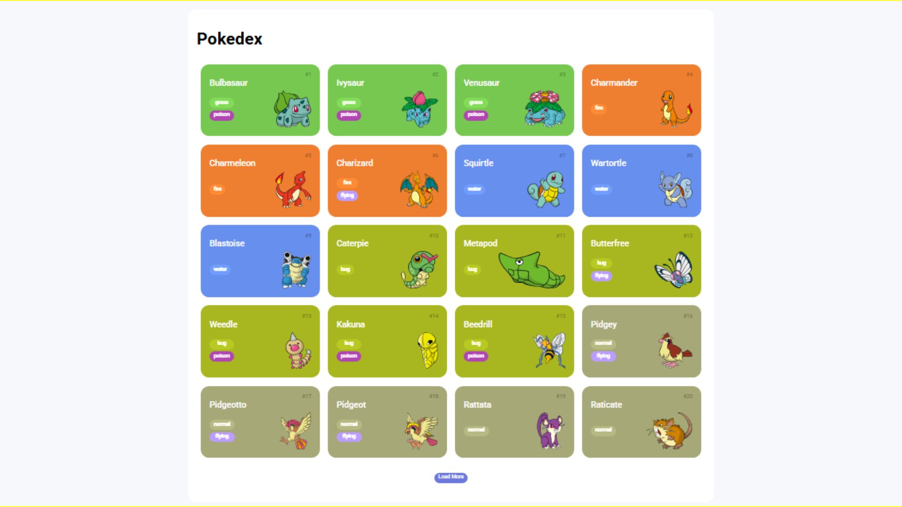
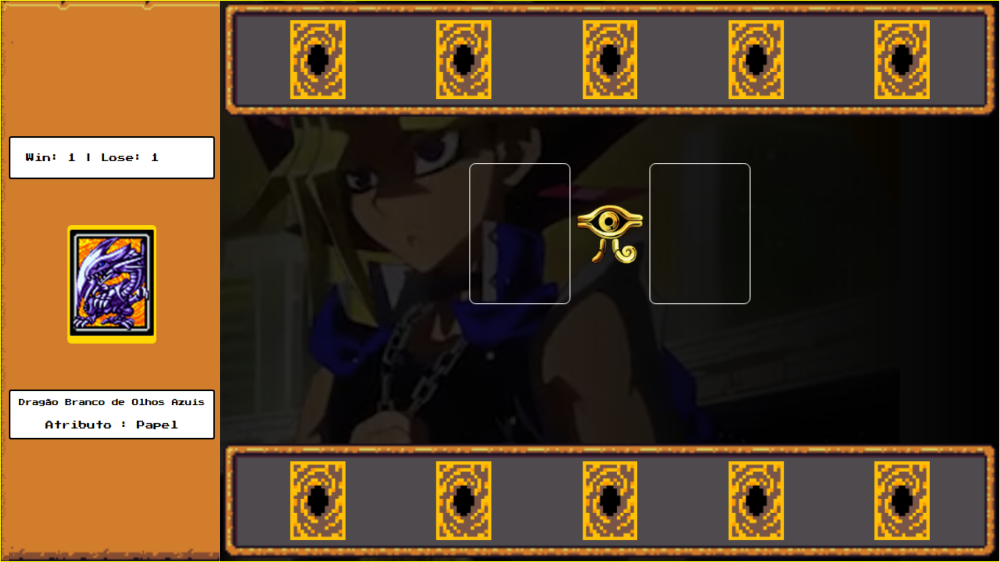
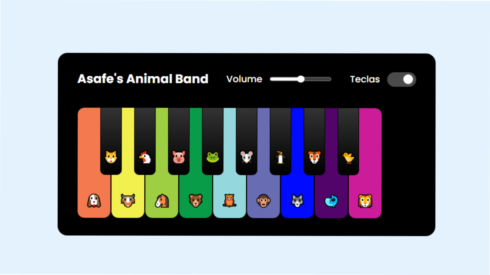
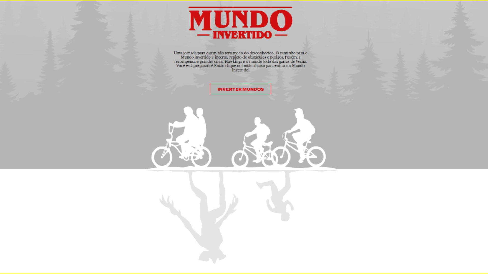
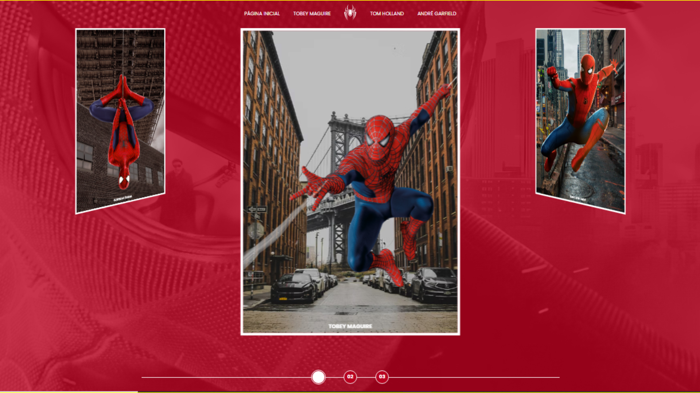

# ✨ Miriã Amaral - Landing Page: Meu Primeiro Desafio de Portfólio ✨

Bem-vindo(a) ao meu primeiro grande desafio de portfólio como Desenvolvedora Front-End\! Este projeto representa uma etapa importante da minha jornada, onde apliquei e consolidei diversos conhecimentos em HTML, CSS e JavaScript para criar uma landing page profissional e interativa.

## 🚀 Sobre o Projeto

Este repositório contém o código-fonte de uma landing page pessoal, desenvolvida com o objetivo de apresentar meus projetos e um pouco sobre quem eu sou. É um projeto que demonstra minha evolução e comprometimento com as boas práticas de desenvolvimento web.

## 💡 Funcionalidades Destaque

* **Design Responsivo:** Otimizado para visualização em qualquer dispositivo, do desktop ao mobile.
* **Alternador de Tema (Claro/Escuro):** Personalize sua experiência de visualização com o tema de sua preferência. A página lembra sua escolha para futuras visitas e respeita a preferência do seu sistema operacional.
* **Cards de Projeto Interativos:** Cada projeto é exibido com uma miniatura visual e um efeito suave de hover, convidando à exploração.
* **Navegação Suave:** Menus com scroll suave para as seções da página.
* **Acessibilidade:** Implementação de `aria-labels`, `alt-texts` e estados de foco para uma navegação inclusiva.

## 🛠 Tecnologias Utilizadas

* **HTML5:** Estrutura semântica da página.
* **CSS3 (com variáveis CSS):** Estilização completa, temas claro/escuro e responsividade.
* **JavaScript (Vanilla JS):** Lógica para o alternador de tema e interatividade geral.
* **Git & GitHub:** Controle de versão e hospedagem.

## 📂 Meus Principais Projetos (Exemplos neste Portfólio)

Explore os projetos abaixo e clique para ver o código no GitHub\!

 

    <a href="https://github.com/miriaamaral/JS-Jogo-Detona-Ralph" target="_blank" style="text-decoration: none;">
        
        
Jogo Detona Ralph

    </a>
    <a href="https://github.com/miriaamaral/JS-Jogo-da-Memoria" target="_blank" style="text-decoration: none;">
        
        
Jogo da Memória JS

    </a>
    <a href="https://github.com/miriaamaral/JS-Pokedex" target="_blank" style="text-decoration: none;">
        
        
Pokedex JS

    </a>
    <a href="https://github.com/miriaamaral/JS-Jogo-YuGiOh" target="_blank" style="text-decoration: none;">
        
        
Jogo Yu-Gi-Oh

    </a>
    <a href="https://github.com/miriaamaral/js-keyboard-virtual-zoo" target="_blank" style="text-decoration: none;">
        
        
Keyboard Virtual Zoo

    </a>
    <a href="https://github.com/miriaamaral/Landing-Page-Mundo-Invertido" target="_blank" style="text-decoration: none;">
        
        
Landing Page Mundo Invertido

    </a>
    <a href="https://github.com/miriaamaral/Landing-Page-Multiverso-Homem-Aranha" target="_blank" style="text-decoration: none;">
        
        
Landing Page Multiverso Homem Aranha

    </a>

 

    <h3>🔗 Veja este Desafio Online:</h3>
    

## ✉️ Contato

Vamos nos conectar e construir algo incrível juntos\!

* **LinkedIn:** [Miriã Amaral](https://www.linkedin.com/in/miriaamaralcs)
* **GitHub:** [miriaamaral](https://github.com/miriaamaral)
* **Email:** [miriaamaralcs@gmail.com](mailto:miriaamaralcs@gmail.com)
* **Discord:** [miriaamaralcustodiosantos](https://discord.com/channels/miriaamaralcustodiosantos)

---

Feito com ❤️ por Miriã Amaral
